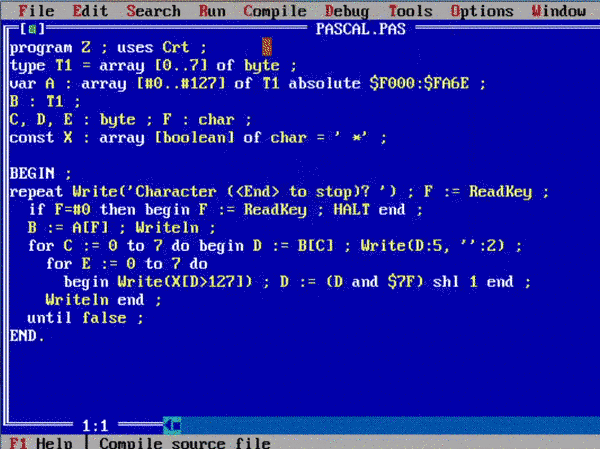

# Assembly projects

## Table of Contents
- [Schema](#schema)
- [Used software](#used-software)
- [Project 1](#project-1)
- [Project 1 solution](#project-1-solution)
- [Project 2](#project-2)
- [Project 2 solution](#project-2-solution)
- [Compilation](#compilation)
- [Pascal](#pascal)

## Schema


## Used software
- ml.exe - Microsoft Macro Assembler Version 6.11
- Visual studio code with 'x86 and x86_64 Assembly' extension
- DOSBox 0.74-3
- emu8086 (!! it doesn't store vga fonts in memory (required in task2) !!)

## Project 1

**Description:**\
Please write a file encryption program based on the XOR function and a multi-character password. The result of the program should be an encrypted copy of the input file.
Assuming that the content of the input file is e.g. text:\
"Wszyscy wiedzą, że czegoś nie da się zrobić, aż znajdzie się taki jeden, który nie wie, że się nie da, i on to robi."\
and the password is:\
"Albert Einstein "

then the encryption should look like this (xoring letter by letter):\
Wszyscy wiedzą, że czegoś nie da się zrobić, aż (…)\
&emsp;&emsp;&emsp;&emsp;&emsp;&emsp;&emsp;&emsp;&emsp;&emsp;XOR\
Albert Einstein Albert Einstein Albert Einstein (…)\

'W' xor 'A'\
's' xor 'l'\
'z' xor 'b'\
'y' xor 'e'\
's' xor 'r'\
'c' xor 't'\
'y' xor ' '\
' ' xor 'E'\
'w' xor 'i'\
etc...


Encryption is symmetrical, so the file should be able to be decrypted with the same password.\
An example of calling the program:\
```program.exe file_in file_out "encryption key"```


## Project 1 solution 
[Click to show code](./task1.asm)

## Project 2

**Description:**\
Please write a program whose parameters at startup will be the number representing ZOOM and any short text. After pressing ENTER, the program should display on the screen in VGA graphic mode (320x200, 256 colors) the text given earlier in the command line enlarged ZOOM times, using only direct access to the image memory. You can not use DOS and BIOS functions to create an image. The program should allow to return to the operating system by pressing any key.

 

An example of calling the program:\
```program.exe 8 "This is the text! 123"```

The effect may look like this:\


## Project 2 solution
I added the ability to scroll text with arrows (left and right)\
[Click to show code](./task2.asm)


## Compilation

Run &nbsp;
```ml.exe file.asm```
&nbsp;&nbsp;under DOS (I've used DOSBox 0.74-3)

## Pascal
Pascal program was created to figure out how fonts are stored in memory. Code was found on [stackoverflow.com](http://stackoverlow.com). Compile with dos version of turbo pascal 7.x or use PASCAL.EXE :wink:\
[Click to show code](./pascalFontDrawer.pas)\

